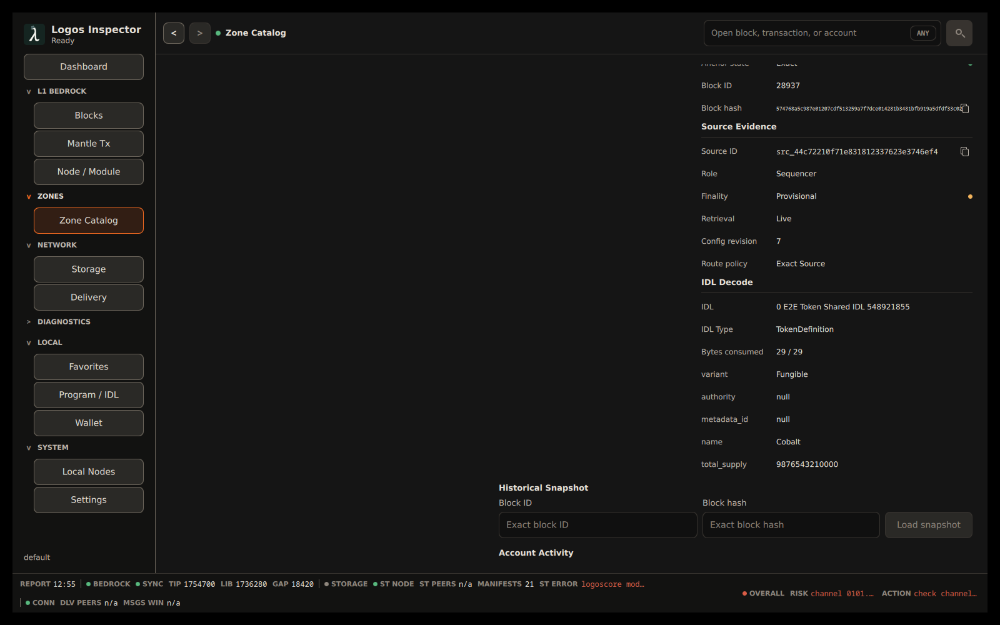

# Inspect and interact with Logos networks

This guide explains the normal desktop workflow for observing Bedrock and
Zones, decoding program data, interacting with a sequencer program, using a
local wallet, collaborating through Delivery, and safeguarding local Inspector
state. It describes the labels and safety gates in the current application;
the status reported by a configured source is always authoritative for that
source.

For installation and launch commands, see the [README](../README.md). For a
Testnet connection and local LogosCore lifecycle walkthrough, see
[`testnet-operations.md`](testnet-operations.md).

## Before changing or sending anything

Inspector separates observation from actions that alter node, wallet, or
network state. Start with these checks:

1. Open **System** → **Settings** → **Network**.
2. Select **Blockchain**, **Messaging / Delivery**, and **Storage** in turn.
   Use **Query status** after changing a connector or endpoint.
3. Read the status detail, not only the status color. A successful status
   query only establishes the capability reported by that named source.
4. If you are using a local wallet, open **Local** → **Wallet** → **Profiles**
   and use **Check** before creating an account or sending a transaction.

An automatic refresh interval of `0` disables automatic refresh. Use
**Query status** for an immediate read-only check, or choose a non-zero
interval for continued observation.

`n/a` in the footer or a dashboard graph is not a failure by itself. It can
mean that no accepted report exists yet, a rate needs a second sample, or the
selected connector does not provide that metric. Query the relevant source and
read its detail before treating `n/a` as a node problem.

### Choose the source deliberately

Each network service has its own connector setting. **Direct RPC** (or the
service's direct REST setting) reads the configured endpoint. **LogosCore CLI**
uses the local CLI transport to call the loaded module. The application does
not silently replace a CLI response with a direct RPC response.

This distinction matters for Zone inspection: a Zone catalog needs finalized
range and time data. If the selected Bedrock connector does not expose the
catalog reads, the screen explains the missing capability. Configure a source
that does expose those reads before relying on the catalog. For Delivery and
Storage, a metrics-only source is useful for health and rates; it is not a
replacement for the operation source used to read content or submit an
operation.

## Find the relevant screen

| Goal | Navigation | Main actions |
| --- | --- | --- |
| Check current chain activity | **Dashboard** | Open a recent block, transaction, or Zone; use **View all** for the full list. |
| Inspect L1 | **L1 Bedrock** → **Blocks** or **Mantle Tx** | Open a row, slot, header, or transaction hash. |
| Diagnose the L1 source | **Diagnostics** → **Bedrock** | **Refresh Bedrock source**; open Bedrock settings. |
| Find and configure a Zone | **Zones** → **Zone Catalog** | Filter, select a Zone, then use **Sources**. |
| Inspect L2 | A Zone's **L2 Blocks**, **Accounts**, **Programs**, or its **Sequencer** dashboard | Select an exact source when prompted. |
| Register or share an IDL | **Local** → **Program / IDL** | **IDLs** or **Sharing** tab. |
| Use a local wallet | **Local** → **Wallet** | **Profiles**, **Controls**, **LEZ Accounts**, **Private Sync**, and **Operations**. |
| Manage local services | **System** → **Local Nodes** | Runtime controls, node **Configure**, and Indexer package actions. |
| Back up local Inspector data | **System** → **Settings** → **General** → **Backups** | **Create Local**, **Upload**, **Download**, and **Restore**. |

The **Zones** menu always contains **Zone Catalog**. A verified configured
sequencer Zone can also appear there as its own dashboard entry. Enable or
remove those optional entries in **Settings** → **User Interface** →
**Navigation** → **Zones menu**.

## Inspect Bedrock safely

### Blocks and transactions

1. Open **L1 Bedrock** → **Blocks**.
2. Use **Live** to start the live view. While it is active, **Refresh Live**
   requests another current view; use **Stop** to leave live mode.
3. Open a block row, its slot, or its header to inspect the corresponding
   **Bedrock Block**. The table distinguishes finalized, confirmed, pending,
   and orphaned status; do not infer finality from ordering alone.
4. Open **L1 Bedrock** → **Mantle Tx** to inspect current L1 transactions.
   Select a transaction hash to open **Mantle Transaction**, or a header to
   navigate to its block.

The Dashboard's **Recent L1 Blocks** and **Recent L1 Transactions** panels are
shortcuts into the same evidence, not a separate data source.

### Zone catalog readiness

Open **Zones** → **Zone Catalog**. It can show **All**, **Sequencer**, **Data**,
and **Needs attention** rows, and can be filtered by Zone name or Channel.

The catalog waits for finalized Bedrock data. During synchronization, it shows
the current **Finalized LIB**, its required catalog checkpoint, and remaining
slots. Wait for that progress to reach the checkpoint; Zone rows resume
automatically. A message such as **Cached catalog rows / verification
required**, a partial coverage state, or a mismatch means that the retained
rows are context only. Do not save a Zone source or use those rows as verified
current data until the catalog reports verification.

Use **Retry catalog** after correcting a source error. **Open Bedrock settings**
takes you to the source configuration when catalog reads are unavailable.

### Inspect a Zone and configure its sources

Select a verified Zone. Its detail view provides **Overview**, **L2 Blocks**,
**Accounts**, **Programs**, **Transfers**, **Sources**, and **L1 Evidence**.

In **Sources**:

1. Use **Add Sequencer source** for the Zone's sequencer endpoint. Choose
   **RPC** for an explicit endpoint or **Module** for the matching local module
   route. Give remote HTTP access only when the displayed warning is acceptable.
2. Use **Configure Indexer** to attach or configure the Channel Indexer for
   this Zone. The indexer is a Zone-level source, not a global substitute for
   every Zone.
3. Save only after the screen accepts the source and reports the current
   source revision. If another edit changes the source first, reload it and
   review the new value rather than overwriting it blindly.

Once a sequencer source is selected, choose **Sequencer** to open its dashboard.
The dashboard has **Blocks / Transactions**, **Accounts**, and **Programs**.
If it asks for a source, return to **Zone Sources** and configure the missing
sequencer or indexer route.

### L2 provenance and finality

The L2 views deliberately retain provenance. **L2 Blocks** identifies the
source and finality of every result. **Accounts** can combine a finalized
Indexer snapshot with a provisional Sequencer snapshot; the page labels which
one supplied each value. A historical account lookup accepts a block ID or hash
and loads that snapshot rather than silently treating it as current state.

When inspecting an L2 transaction, use the **Inspection** and **Trace** tabs.
If several sources could have produced a result, choose the exact source shown
by the screen before acting on derived data. This avoids mixing an account,
transaction, or program result from one endpoint with a request to another.

## Register an IDL; decoding then happens automatically

Inspector is program-agnostic. It does not guess a program schema from account
or transaction bytes. Instead, register the matching user-provided IDL:

1. Open **Local** → **Program / IDL** and select **IDLs**.
2. Enter the program's **Program ID** in hex or Base58.
3. Paste the **IDL JSON**. **IDL name** is populated from valid JSON when
   possible; supply a name if needed.
4. Select **Save IDL**. Use **Summarize** first if you want a local overview of
   the schema.

The Program ID must match the account owner or program responsible for the
instruction. Registering an unrelated IDL does not make opaque data safe to
interpret.

After a matching IDL is registered, Inspector automatically attempts to decode
loaded Zone account snapshots and transaction instructions. There is no
separate manual "decode" action:

- In **Accounts**, inspect an account. The snapshot shows **Decoding account**
  while the automatic pass is running, then an **IDL Decode** section when a
  registered IDL matches.
- In a transaction's **Trace** view, a matching instruction can show
  **Decoded Instruction** alongside the raw evidence.
- If there is no matching schema, the application says that decoding is
  unavailable or that no registered IDL decoded the data. Verify the owner,
  Program ID, and IDL version rather than interpreting the bytes by guesswork.

Changing the local registry or shared-IDL policy causes existing eligible
snapshots to be evaluated again. That improves visibility, but it does not
prove a third-party IDL is trustworthy.

*Compiled Testnet account inspection: the **Source Evidence** is visible beside
an automatically produced **IDL Decode** section with its IDL, type, consumed
bytes, and decoded fields. The source's displayed finality is **Provisional**
in this capture, so use the provenance and finality labels when deciding how to
act on the decoded result.*

## Interact with a registered sequencer program

Use this workflow only after the Zone catalog and the selected sequencer source
are verified.

1. Open a Zone's **Programs** view or its **Sequencer** dashboard and select
   the program interaction area.
2. Select a **Registered IDL**, then an **Instruction**.
3. Enter each requested account and typed argument. The form is derived from
   the saved IDL.
4. Select **Preview**. Inspector builds a **Frozen preview**.
5. Read **Exact target** carefully: it records the Channel, selected source,
   and endpoint that will receive the transaction. Review the account roles,
   argument values, public/private indication, and all fee or wallet prompts.
6. Select **Review & Send**. Read the confirmation dialog, then choose
   **Send transaction** only if the frozen preview is correct.
7. Keep the resulting transaction identifier and use **Open transaction** to
   inspect the submitted transaction once the source can find it.

Changing an account, argument, instruction, IDL, Zone source, or source
revision invalidates the premise of the preview. Build and inspect a new
preview instead of assuming a previous approval still targets the current
endpoint. Inspector submits only the frozen preview shown in the confirmation.

For a private transaction, submission can complete before the local private
account view catches up. When the screen shows **Private sync pending**, open
**Local** → **Wallet** and use **Read incoming** after inclusion to update
local private account state.

## Configure and use a local wallet

### Connect a profile

Open **Local** → **Wallet** → **Profiles**. A profile reports the configured
wallet binary, wallet home, version, and Bedrock node. Use **Autodetect** to
find a local setup or **Open Settings** to configure it manually. The Wallet
settings panel contains **Wallet binary**, **Wallet home**, and **Bedrock node**.
Use **Check** after any change.

Do not put a seed phrase, private key, or mnemonic into Inspector fields. Use
the wallet's configured local environment and its confirmation prompts.

### Account and transfer controls

The **Controls** tab is the action surface:

- **Create Account** lets you choose **Public** or **Private** and optionally
  give the account a label. Creation requires confirmation.
- **Send Native** collects the source, destination, amount, and optional
  key-related fields required by the wallet. Review the confirmation before
  sending.
- **Read incoming** synchronizes private account data from the wallet's
  incoming state. It is intentionally a manual action, so use it after a
  private transaction is included.
- **Advanced Command** accepts explicit wallet arguments and still requires
  confirmation. Treat it as an operator tool, not a way to bypass review.

**LEZ Accounts** lists accounts known locally. It is distinct from the Zone's
chain-account inspector. Use **Bedrock Wallet** for address/public-key and
REST balance checks, and **Operations** to review the result of wallet actions.

## Comments, identities, and shared IDLs

### Public comments

Account and transaction detail screens can include **Comments**. This is a
public Delivery-based collaboration feature, not a private message channel.

1. Open a verified Zone account or transaction.
2. In **Comments**, choose or create the identity scope shown by the screen.
3. Write the comment and select **Post**.
4. Review the **Post comment** confirmation before publishing.
5. Use **Refresh** and **Next page** to read available comments.

Comments can be unavailable when the current Zone does not have a verified
network identity or when Delivery lacks the Store query capability. The screen
names the missing prerequisite. Correct that source configuration rather than
assuming a green network indicator alone enables comments.

### Share and receive IDLs

Open **Local** → **Program / IDL** → **Sharing**. To share a local schema,
select the **Account ID** and **Local IDL**, then use **Share IDL**. Sharing
requires a verified Channel Zone and a configured social identity. Only share
an IDL that you are entitled to publish and that accurately represents its
program.

The received-IDL policy controls what Inspector does with verified matching
shared IDLs:

| Policy | Behavior |
| --- | --- |
| **Suggest** | Offers matching shared schemas as candidates; locally registered IDLs remain preferred. |
| **Session** | Makes a verified candidate usable for the current session without saving it to the local registry. |
| **Auto-register** | Saves a verified shared candidate in the local registry with shared-source metadata. |
| **Disabled** | Ignores shared candidates. |

The **Auto-share verified local IDLs** toggle controls whether eligible local
IDLs are shared automatically. Automatic decoding can use policy-accepted
candidates, but source verification and a matching Program ID remain necessary.
Review shared schema provenance before selecting **Auto-register**.

## Back up and restore Inspector state

Open **System** → **Settings** → **General** → **Backups**. Backups contain
selected Inspector data, not a substitute for separately securing the wallet:
**Settings**, **Favorites**, **IDL Registry**, and **Wallet Profile** can be
included. Select only the categories you intend to restore.

### Create and upload a backup

1. Choose the desired **Backup Contents**.
2. Select **Create Local**. The entry appears in **Local Backup Catalog**.
3. Optionally turn on **Encrypt with wallet**. This requires a configured wallet
   home, and restoring it requires the same wallet configuration.
4. Select **Upload** only when Storage upload capability is available. The
   catalog keeps the remote CID with the local entry.

If **Storage upload unavailable** appears, configure a Storage operation source
with the required capability before uploading. Do not treat an old CID as proof
that an upload succeeded; read the backup status message.

### Download and restore safely

1. Enter a **Backup CID** and select **Download**. The confirmation explains
   that this adds the data to **Local Backup Catalog**; it does not import it
   immediately.
2. Locate the downloaded or local entry and select **Restore**.
3. In **Import local backup**, inspect the plan, warnings, and conflicts.
   Choose a mode for every included category: settings and wallet profile can
   be replaced or skipped; favorites and IDLs also support merging.
4. Resolve the per-item conflicts, then approve **Import** only after the
   chosen replacement or merge effects are clear.

This staged flow is intentional: creating or downloading a backup is
reversible catalog work, while importing it can replace active local settings
or wallet-profile configuration.

## Control local nodes and configure a Channel Indexer

Open **System** → **Local Nodes** to inspect local Bedrock, Delivery, Storage,
and Channel Indexer state. The **LogosCore Runtime** panel shows the modules
directory and binary path and offers the available start/stop controls. An
already-running local daemon can be managed through its discovered lifecycle
target; if operating-system access is denied, Inspector should show that error
rather than hiding the local runtime.

Lifecycle actions such as initialize, install, configure, start, stop, purge,
and uninstall each present a confirmation. Read the node, data-directory, and
consequence text before accepting a destructive action. Purge removes local
state; make a backup and stop the affected service first when the confirmation
or node status calls for it.

The **Indexer package** panel can select an **Exact release**, **Reload
releases**, and **Install release**. Installing the Channel Indexer package
requires the LogosCore runtime to be stopped. After installation, start the
runtime, then configure the actual Zone-specific indexer from that Zone's
**Sources** tab with **Configure Indexer**.

For a node's configuration, choose **Configure** and use:

- **Common settings** for editable connectivity/protocol, directories, API,
  metrics, peer, and logger fields supplied by the node configuration;
- **Raw configuration** for the full JSON editor and syntax-highlighted
  preview.

The two tabs represent one draft. Save or undo changes before switching tabs or
leaving the node. The raw editor must validate before it can be saved. A node
can be shown as read-only when its backend cannot safely expose a writable
configuration; read the supplied reason rather than attempting a workaround
through Inspector.

## When a workflow is unavailable

Most unavailable states name the missing requirement. Use that message to
choose the next check:

| Message or condition | Next action |
| --- | --- |
| Zone catalog requires verification or is behind Bedrock | Wait for finalized progress, then use **Retry catalog** after source recovery. |
| A Zone dashboard has no usable source | Open the Zone's **Sources** and configure the indicated Sequencer or Indexer route. |
| Account or transaction has no decoded data | Register the matching Program ID and IDL; inspect raw provenance rather than guessing. |
| Program interaction asks for an IDL | Open **IDL registry**, save a valid matching IDL, then return to the Zone. |
| Comments unavailable | Check the verified Zone identity and Delivery Store query capability. |
| Backup upload unavailable | Configure Storage upload capability; use a local catalog backup in the meantime. |
| Wallet action cannot proceed | Use **Profiles** → **Check**, then correct the reported binary, wallet home, or Bedrock node setting. |

For deeper read-only connection evidence, use **Diagnostics** → **Bedrock**,
**Storage**, **Delivery**, or **Capabilities**. The Bedrock diagnostics screen
explicitly does not change node state; it is a safe first stop when chain
inspection is not loading.
