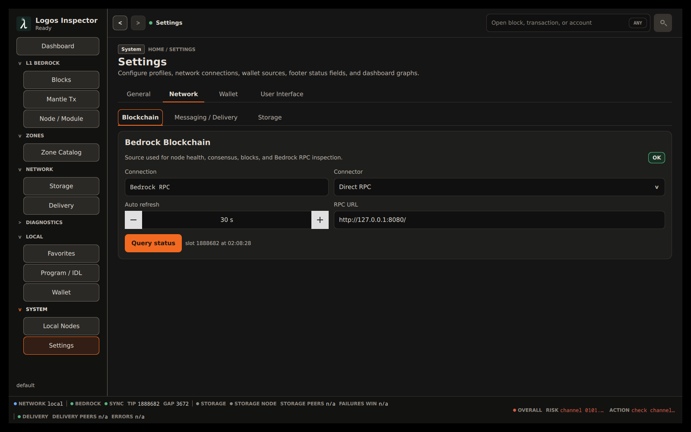
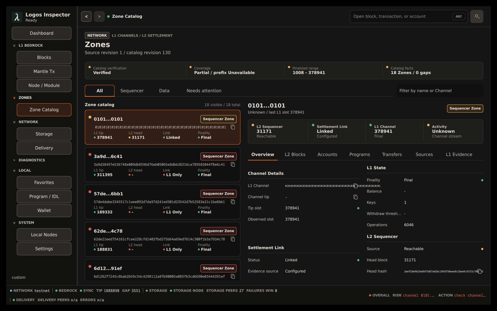
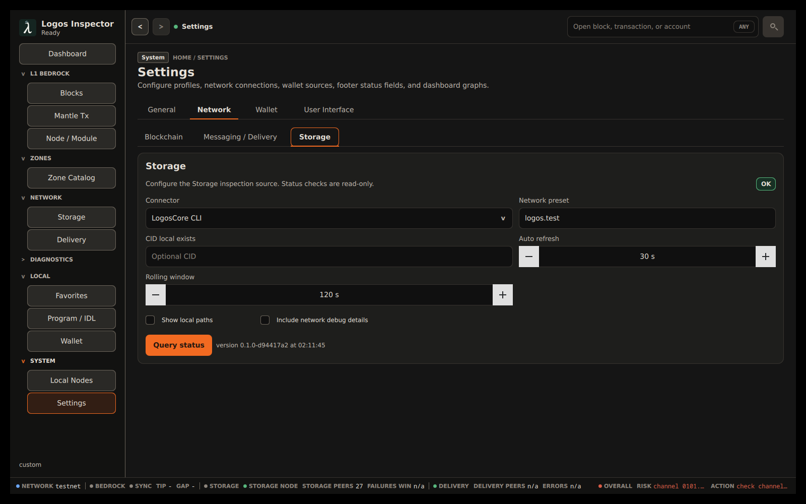
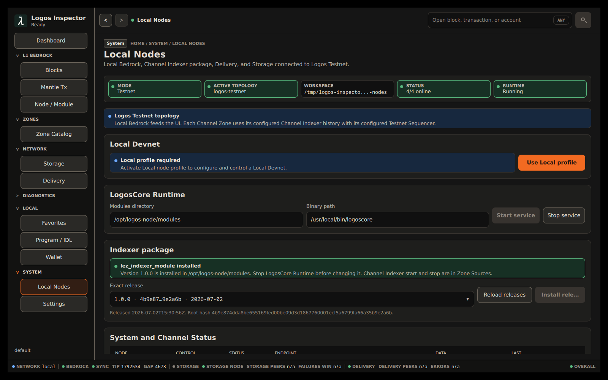

# Operating Logos Inspector on Testnet

This guide is for an operator using the desktop application against Logos
Testnet. It explains how to establish what the application is reading, how to
operate a local LogosCore service through Inspector, and how to reach a
configured Zone's sequencer dashboard.

It does not replace the safety confirmation shown before a lifecycle action.
Read that confirmation carefully: it describes the exact node, data directory,
and consequence of the selected action.



*Compiled Inspector source check. The **OK** badge applies to the named Direct
RPC Bedrock source; check Delivery and Storage separately rather than treating
one successful source as whole-application health.*

## Start Inspector and establish a Testnet baseline

The packaged standalone application is the simplest way to open Inspector:

```bash
nix run .#standalone
```

For a source checkout, see the build and launch instructions in the
[README](../README.md). The default **Testnet** profile uses a local Bedrock
endpoint (`http://127.0.0.1:8080/`) connected to Logos Testnet; it does not
turn an arbitrary remote endpoint into a Testnet source automatically.

After opening Inspector:

1. Open **Settings** → **General** and confirm that **Network profile** is
   **Testnet**. Choose **Restore Testnet defaults** if you deliberately want to
   reset network and user-interface settings. That reset leaves the wallet
   profile unchanged.
2. Open **Dashboard**. It shows recent L1 blocks and transactions, selected
   live graph tiles, and a compact **Zones** panel.
3. Open **Settings** → **Network**. For **Blockchain**, **Messaging /
   Delivery**, and **Storage**, select **Query status**. These checks are
   read-only.
4. Wait for each requested source to report **OK**, then return to the
   Dashboard and confirm that its current data is consistent with the selected
   sources.

An automatic refresh interval of `0` means that source's automatic refresh is
off. Use **Query status** for an immediate read-only check or set a non-zero
interval when continuous observation is wanted.

## Read health and partial-state signals correctly

Inspector keeps source health, chain state, and local process control separate.
Do not treat a green-looking value as proof that every feature is available;
read the named source and the accompanying detail.

| Where | Healthy signal | Partial or action-needed signal |
| --- | --- | --- |
| **Settings** → **Network** | **OK** means the latest status query for that named connector succeeded. | **Unknown** means it has not been queried; **Error** supplies the connector's latest failure detail. |
| Footer and Dashboard graphs | Current source facts and graph samples populate after accepted reports. | `n/a` can mean no accepted sample yet, a rate that still needs a second sample, or a metric the selected connector does not expose. |
| **Dashboard** → **Zones** | A current catalog can show Zone rows, source states, and finality. | **Cached catalog / verification required** means the rows are retained for context, not safe to use as verified current data. |
| **Zones** catalog status | **Catalog verification: Verified** with **Coverage: Complete** is the strongest normal operating state. | **Partial**, **Rebuilding**, a gap count, or **Mismatch** means catalog completeness has not been established. |
| **Local Nodes** | In Testnet mode, `N/N online` means that the listed local sources were observed online. | **Syncing**, **Unavailable**, and **Unknown** are observation states. The **Control** column describes whether Inspector has a usable control path, not whether the service is healthy. |

### When Bedrock is still catching up

The Zone catalog intentionally waits for finalized Bedrock data. If the page
shows **Bedrock synchronization in progress**, it also shows:

- the current **Finalized LIB**;
- the catalog's required checkpoint; and
- the number of remaining slots.

Zones resume automatically once the checkpoint is reached. Do not work from
cached Zone rows while the catalog says verification is required; selecting a
Zone or saving a source configuration is intentionally blocked until the
catalog is verified.



*Compiled Testnet capture: the catalog is **Verified**, has 18 Zones and zero
gaps, and the selected L2 Sequencer is reachable. It also explicitly reports
**Coverage: Partial / prefix unavailable**. This is a functioning partial
catalog state, not evidence of complete coverage.*

## Choose the right connector

Open **Settings** → **Network**, choose the service tab, and use its
**Connector** control. The selection is per service, so Bedrock, Delivery, and
Storage may use different appropriate connectors.

| Service | Direct connector | Local module connector | Choose direct when | Choose LogosCore CLI when |
| --- | --- | --- | --- | --- |
| Bedrock Blockchain | **Direct RPC** | **LogosCore CLI** | You need an explicit Bedrock RPC endpoint, especially for Zone catalog reads. | A local `blockchain_module` is loaded and its CLI read surface supplies the view you need. |
| Messaging / Delivery | **Direct Waku REST** | **LogosCore CLI** | You are inspecting a Waku REST endpoint or its optional metrics endpoint. | A local `delivery_module` is loaded and you want Inspector to call it through LogosCore. |
| Storage | **Standalone REST** | **LogosCore CLI** | You are inspecting a Storage REST endpoint or metrics endpoint. | A local `storage_module` is loaded and you want Inspector to call it through LogosCore. |

**Direct** connectors expose the matching URL field. **LogosCore CLI** routes
its module operations through Inspector's local LogosCore CLI transport rather
than an arbitrary module URL. Delivery can additionally show a **Waku REST
health URL** for status reporting; that health check does not turn Delivery
operations into REST operations. In either case, press **Query status** after
changing the connector and use its reported detail as the source of truth.

Use the direct connector if the CLI module does not offer a needed read. For
example, the Zone catalog requires finalized-range and time data: **Direct RPC**
is the reliable choice, while a LogosCore CLI Bedrock selection can serve the
catalog only when its loaded module exposes the required catalog reads. Inspector
does not silently pretend that one connector's successful response came from a
different connector.

For Delivery and Storage, the **Metrics only** choices are health/metric
sources, not substitutes for the REST or module operations needed to inspect
content or send an operation. The Delivery **Rolling window** and Storage
**Rolling window** affect rate-oriented readings; the first sample can therefore
be unavailable until another accepted observation arrives.



*Compiled Testnet capture. The selected Storage connector is **LogosCore CLI**,
its `logos.test` preset is visible, and the named source reports **OK**. This
does not imply that a separately selected Bedrock or Delivery connector uses
the CLI too.*

## Inspect and control an already-running local LogosCore service

Open **Local Nodes** from the system navigation. Inspector refreshes local
status when the page opens. Its **LogosCore Runtime** panel distinguishes two
safe cases through the text it displays:

- **Start** / **Stop**: an Inspector-managed local runtime can be started or
  stopped from this panel. The **Modules directory** and optional **Binary
  path** define its local setup.
- **Start service** / **Stop service**: Inspector discovered an already-running
  local LogosCore daemon and a verified local service lifecycle target. These
  buttons control that local service; they do not create a second daemon.

Use the existing-service path as follows:

1. Open **Local Nodes** and wait for the Status and Runtime chips to settle.
2. Confirm that the Runtime chip identifies the local service and that the
   **Start service** or **Stop service** action is enabled.
3. Select the action, read the confirmation, and confirm it.
4. Wait for the operation result and refresh the page. Treat **Starting** or
   **Stopping** as transitional until the Runtime and node states settle.

If Inspector can contact a local daemon but cannot verify a service lifecycle
backend, it keeps the connection visible and reports a configuration-required
reason instead of guessing how to stop it. Likewise, a permissions error is a
real operating condition: use the displayed detail to correct the local service
configuration or access rights, then refresh. Do not start a second managed
runtime merely to work around an attached local service.

### Start and stop configured nodes

The **Actions** panel lists only actions available to each currently discovered
node. A normal node workflow is:

1. Use **Configure** before starting a node when its configuration needs
   adjustment. The configuration panel has **Common settings** and **Raw
   configuration** tabs backed by the same JSON document.
2. Edit common fields for the usual connectivity, data, API, metrics, peers,
   and logging values, or switch to the raw JSON editor for an advanced change.
   Save or undo a draft before changing tabs. Inspector performs syntax and
   configuration validation; **Save** stays disabled until the current draft is
   valid.
3. Use **Install** or **Initialize** when that is the enabled prerequisite for
   the node, then select **Start** and confirm it.
4. Verify the observed **Run** state and the operation result. In Testnet mode,
   `Online` reflects a confirmed observation; `Syncing` is not yet ready for
   fully current data.
5. Select **Stop** and confirm it when the service should stop. Re-open the
   configuration only after the action has finished.

**Purge** stops the selected node and deletes its data directory while keeping
its configuration and install record. **Uninstall** stops the node and removes
its install registration while leaving node databases in place. Both actions
are destructive or disruptive enough to require confirmation. Messaging may
also require re-initialization after a stop; the confirmation text states the
identity and lifecycle consequence before it runs.



*Compiled Inspector Local Nodes view after the attached local LogosCore service
had restarted: **Mode: Testnet**, **Runtime: Running**, and **Status: 4/4
online**. It is evidence of that local service state only; it does not claim
that every remote source metric or Zone catalog is healthy.*

### Install and run a Channel Indexer

An Indexer package is selected and installed under **Local Nodes**, but it is
started for a particular Zone from that Zone's source configuration.

1. In **Local Nodes**, use **Indexer package** → **Reload releases**, select an
   exact official `lez_indexer_module` release, then choose **Install release**
   and confirm it. The LogosCore Runtime must be stopped while the package is
   changed.
2. Open **Zones**, select the intended verified sequencer Zone, then open its
   **Sources** tab.
3. Configure an Indexer source that uses the managed module. The page explains
   when an external RPC remains externally managed.
4. In **Managed Channel Indexer**, use **Configure** while it is stopped if
   needed, then choose **Start for this Channel** and confirm the action.
5. Watch the Package, LogosCore, and Indexer status chips until the Indexer is
   running or caught up. Use **Stop** from the same Zone when that channel's
   isolated Indexer should stop.

Each managed Channel Indexer has an isolated Inspector-managed LogosCore
runtime and is bound to the selected Sequencer source for its channel. It is
not a global Indexer start/stop action in the Local Nodes table.

## Explore Zones and a sequencer dashboard

The Dashboard's **Zones** panel is a compact entry point. Select a Zone row to
open its detail, or use **View all** to open the full **Zones** page.

On **Zones**:

1. Confirm the catalog is **Verified** before treating rows as actionable.
2. Filter the catalog by **All**, **Sequencer**, **Data**, or **Needs
   attention**, and optionally filter by a Zone name or Channel ID.
3. Select a row to inspect its overview, L2 blocks, accounts, programs,
   transfers, sources, and L1 evidence.
4. For a verified **Sequencer** Zone with a selected Sequencer source, select
   its Channel ID link to open the dedicated **Sequencer** dashboard. A raw
   data channel is not a sequencer dashboard.

The dedicated dashboard has three tabs:

- **Blocks / Transactions**: browse L2 blocks and transactions from the
  selected exact Sequencer source.
- **Accounts**: inspect account state from that source.
- **Programs**: inspect programs and use the available program interaction
  flow. Return to **Zones** to change the source context.

If the dashboard says **Sequencer source required** or **Sequencer source not
ready**, choose **Open Zone Sources** (or **Review Zone Sources**), add or
select a supported source, save it after catalog verification, and wait for the
source to confirm the channel. The dashboard deliberately does not combine
unverified Zone data with a supposedly current sequencer result.

### Configure a Zone's sources

Within a selected Zone's **Sources** tab:

1. Use **Add Sequencer source** to add an RPC or supported module source, give
   it an optional recognizable label, and save it.
2. Select the source that has successfully confirmed this Channel. The selected
   source becomes the source context for the sequencer dashboard.
3. Configure or replace the Indexer source separately. An **External Indexer
   RPC** remains outside Inspector's package and process lifecycle; a managed
   module unlocks the per-channel workflow described above.

Source edits are revision-protected. If the page says that a source revision
changed, reload the draft and review the current source configuration before
saving. If catalog verification changes, keep or discard the draft, but do not
expect Inspector to apply it until verification returns.

## Safe operating habits

- Keep the selected connector visible in **Settings** while diagnosing data;
  an endpoint, a LogosCore module, and a metric scrape are different sources.
- Use status detail, catalog verification, and source-specific error messages
  before restarting or purging a service.
- Prefer **Stop** over **Purge** when investigating a fault. Purge discards the
  node's local data and forces recovery work.
- Treat a missing connector capability as a source-selection or module API
  limitation, not as proof that on-chain data does not exist.
- Do not put wallet keys, recovery phrases, endpoint credentials, or private
  configuration in screenshots, issues, or source control.
